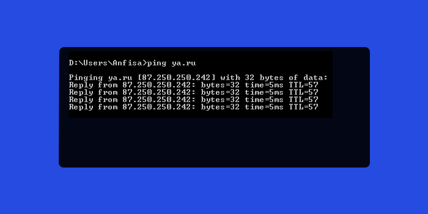
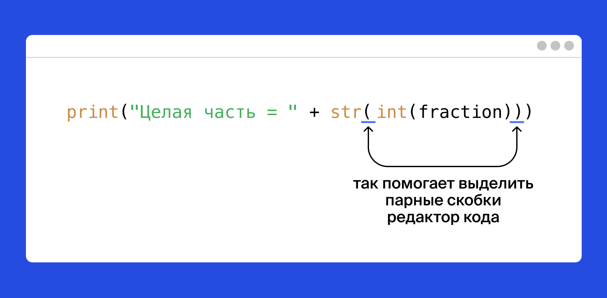

# (PART) ОСНОВЫ PYTHON {-} 

# Знакомство с Python


## Как работает интернет

Понимаем, что вам уже не терпится написать свои первые строки кода. Но перед погружением в разработку полезно разобраться, как устроен интернет. Посмотрите видео о том, что происходит, когда вы набираете адрес сайта в браузере.

**Чему вы научитесь**

Для начала — основы Python. Вы научитесь отправлять запросы к настоящим серверам в интернете, получать ответы и обрабатывать их.

**Постановка задачи**

Вы создадите собственного персонального помощника вроде Алисы, Google Assistant, Siri, Alexa. Назовём её ***Анфиса*** :) Она слегка проще, знает только ваших друзей. Анфиса будет определять, в каком городе они находятся, и в режиме реального времени сообщать, какая у них погода.
Поехали!

## Что такое Python

Python — язык простой: у него лаконичный и в то же время понятный синтаксис.

***Python*** применяют IT-гиганты: Яндекс, Google, Facebook, Dropbox, Mozilla и Microsoft. На нём написаны такие приложения, как YouTube, Instagram, PayPal, внутренние сервисы Facebook и сервисы Wargaming.

Обычно программы состоят из множества строк, в которых записаны команды на языке Python. Команды выполняются последовательно, одна за другой, и их выполнение приводит к желаемому результату.

Знакомство с Python начнём с простой программы.

\BeginKnitrBlock{exercise}<div class="exercise"><span class="exercise" id="exr:unnamed-chunk-1"><strong>(\#exr:unnamed-chunk-1) </strong></span></div>\EndKnitrBlock{exercise}

В задаче этого урока вам предстоит выполнить готовую программу из одной строки. А в следующих уроках вы сами напишите свои первые программы. Вперёд!

Мы приготовили для вас простую программу, состоящую из одной команды `import this`.

Выполните программу. 

\BeginKnitrBlock{solution}<div class="solution">\iffalse{} <span class="solution"><em>Решение: </em></span>  \fi{}</div>\EndKnitrBlock{solution}


```python
import this
```

```
## The Zen of Python, by Tim Peters
## 
## Beautiful is better than ugly.
## Explicit is better than implicit.
## Simple is better than complex.
## Complex is better than complicated.
## Flat is better than nested.
## Sparse is better than dense.
## Readability counts.
## Special cases aren't special enough to break the rules.
## Although practicality beats purity.
## Errors should never pass silently.
## Unless explicitly silenced.
## In the face of ambiguity, refuse the temptation to guess.
## There should be one-- and preferably only one --obvious way to do it.
## Although that way may not be obvious at first unless you're Dutch.
## Now is better than never.
## Although never is often better than *right* now.
## If the implementation is hard to explain, it's a bad idea.
## If the implementation is easy to explain, it may be a good idea.
## Namespaces are one honking great idea -- let's do more of those!
```

Это не обыкновенная команда, а «***пасхальное яйцо***», или «***пасхалка***». Эта команда ничего не импортирует, а ***выводит*** на экран при своём исполнении «Дзен Питона».

## Философия Python

Вы только что выполнили команду `import this` и увидели Дзен Питона.

Это рекомендации, как сделать ваш код красивым и понятным для коллег. Когда научитесь настолько, что сможете решать одну и ту же задачу по-разному, вернитесь к этим правилам:

- Красивое лучше, чем уродливое.
- Явное лучше, чем неявное.
- Простое лучше, чем сложное.
- Сложное лучше, чем запутанное.
- Плоское лучше, чем вложенное.
- Разреженное лучше, чем плотное.
- Читаемость имеет значение.
- Особые случаи не настолько особые, чтобы нарушать правила.
- При этом практичность важнее безупречности.
- Ошибка никогда не должна замалчиваться.
- Если только вы сами этого не захотите.
- Встретив двусмысленность, отбрось искушение угадать.
- Должен существовать один и, желательно, только один очевидный способ сделать что-то.
- Хотя он поначалу может быть и не очевиден, если вы не голландец.
- Сейчас лучше, чем никогда.
- Хотя никогда зачастую лучше, чем прямо сейчас.
- Если реализацию сложно объяснить — идея плоха.
- Если реализацию легко объяснить — идея, возможно, хороша.
- Пространства имён — отличная штука! Будем делать их больше!

## Ваш первый код на Python

Самая простая операция в Python — это вывод на экран.


```python
print('Привет, Мир!')
```

```
## Привет, Мир!
```

Разберёмся, что здесь написано.

`print()` — это встроенная в Python подпрограмма для вывода на экран (или для «печати на экране» на жаргоне программистов). У программистов есть специальное название для подпрограмм определённого действия — «***функция***».

`'Привет, Мир!'` — это текст, который функция `print()` напечатает. Функция `print()` выводит на экран любые переданные в неё данные. Программисты называют такие данные «***аргументы***», или «***параметры***». Они перечисляются после имени функции в скобках.

Говорят, что аргументы ***передаются*** в функцию, а функция их ***принимает***. Когда вы пишете имя функции со скобками, вы её ***вызываете***.


```python
# приветствие миру — традиционная первая строка в освоении нового языка
print('Привет, Мир!')

# в программе написан вызов функции print() с аргументом 'Привет, Мир!'
```

```
## Привет, Мир!
```

Строчка, начинающаяся с символа `#` — это ***комментарий***, примечание для разработчика. Python игнорирует любые символы на строчке после `#`, не считая их кодом. Этот текст предназначен вам. Читайте комментарии, в них будут инструкции для вас.

\BeginKnitrBlock{exercise}<div class="exercise"><span class="exercise" id="exr:unnamed-chunk-6"><strong>(\#exr:unnamed-chunk-6) </strong></span></div>\EndKnitrBlock{exercise}

Сейчас вы начинаете создавать собственного персонального помощника вроде Алисы, Google Assistant, Siri, Alexa. Назовём её ***Анфиса*** :)
Научите вашего персонального помощника Анфису здороваться.

\BeginKnitrBlock{solution}<div class="solution">\iffalse{} <span class="solution"><em>Решение: </em></span>  \fi{}</div>\EndKnitrBlock{solution}


```python
# Вызовите функцию print() с аргументом 'Привет, я Анфиса!'
# Впишите код вызова под этой строчкой:
print('Привет, я Анфиса!')
```

```
## Привет, я Анфиса!
```

## Переменные и типы

Окей, вы научились выводить строки на экран. Но пока только выводить.

Представьте: вы читаете книгу, но не можете запомнить, сколько страниц прочли. Умеете читать, но вот запомнить номер страницы не удаётся. Вылетает из головы, где вы остановились, поэтому приходится отсчитывать страницы от начала книги. 10, 24, 140, 250 страниц — каждый раз как в первый.


Так же беспомощны программы, которые не могут сохранять и изменять данные. Именно поэтому настоящее программирование начинается с переменных, запоминающих результаты промежуточных действий.

***Переменная*** работает как подписанная коробка или помеченная ячейка, куда можно что-то положить и не потерять.

Когда вы первый раз записываете имя переменной, это называется ***объявление***. В Python переменную всегда объявляют, присваивая ей какое-нибудь значение. Достаточно просто ввести имя, поставить знак равенства `=` (называется ***оператор присваивания***) и написать значение, которое будет храниться в переменной.

Вернёмся к чтению. Отложив программирование и ночной сон, вы прочли 210 страниц. Теперь можно сказать:


```python
pages = 210
```

В коробку с именем `pages` вы положили значение `210`.
Строка `'Привет, Мир!'` из прошлого урока — это тоже пример данных, которые могут храниться в памяти компьютера.


```python
# объявили переменную message и присвоили ей значение: строку 'Привет, Мир!'
message = 'Привет, Мир!'
```

Теперь, если в программе написать имя переменной, подставится её значение:


```python
# объявили переменную message и присвоили ей значение: строку 'Привет, Мир!'
message = 'Привет, Мир!'
print(message)
```

И на экране будет напечатано


```
## Привет, Мир!
```

Значения переменных отличаются по своей сути. Вы только что увидели, что они бывают числами или строками. Это разные ***типы данных***. В Python встречаются не только числа и строки, но пока хватит и этих двух типов.

***Строка*** записывается как символ или набор символов внутри `'одинарных'` либо `"двойных"` кавычек. Обратите внимание: в редакторе кода числа и строки выделяются разными цветами, чтобы читать исходный код было легче.

Со значениями разных типов операторы языка Python могут работать неодинаково. Например, оператор `+` ведёт себя по-разному в зависимости от типа данных: числа он складывает, а строки — объединяет:


```python
print('Сколько ' + 'вы ' + 'прочли?')

pages = 210
today = 42
total = pages + today

print(total)
```


```
## Сколько вы прочли?
```

```
## 252
```

\BeginKnitrBlock{exercise}<div class="exercise"><span class="exercise" id="exr:unnamed-chunk-16"><strong>(\#exr:unnamed-chunk-16) </strong></span></div>\EndKnitrBlock{exercise}

Чтобы Анфиса стала искренней и дружелюбней, научим её рассказывать о себе. Для начала напечатайте на экран фразу `'Привет, я Анфиса, твой персональный помощник!'`, подставляя переменные `name` и `job`.

\BeginKnitrBlock{solution}<div class="solution">\iffalse{} <span class="solution"><em>Решение: </em></span>  \fi{}</div>\EndKnitrBlock{solution}


```python
name = 'Анфиса'                # имя
job = 'персональный помощник'  # профессия

# допишите ваш код ниже вместо многоточия:
print('Привет, я ' + name + ', твой ' + job + '!')
```

```
## Привет, я Анфиса, твой персональный помощник!
```

\BeginKnitrBlock{exercise}<div class="exercise"><span class="exercise" id="exr:unnamed-chunk-19"><strong>(\#exr:unnamed-chunk-19) </strong></span></div>\EndKnitrBlock{exercise}

Если Анфиса поселится в фитнес-трекере, она сможет считать количество шагов пользователя. Научите Анфису подставлять в сообщение сумму шагов, пройденных за два дня.

В переменных `steps_today` и `steps_yesterday` записано, сколько шагов прошёл незнакомый вам Геннадий вчера и сегодня. Напечатайте на экран ответ на вопрос `Сколько шагов сделал Геннадий за два дня`?

\BeginKnitrBlock{solution}<div class="solution">\iffalse{} <span class="solution"><em>Решение: </em></span>  \fi{}</div>\EndKnitrBlock{solution}


```python
steps_today = 6783
steps_yesterday = 8452

steps_sum = steps_today + steps_yesterday  # вычислите сумму здесь

print('Сколько шагов сделал Геннадий за два дня?')
```

```
## Сколько шагов сделал Геннадий за два дня?
```

```python
print(steps_sum)
```

```
## 15235
```

## Преобразование типов

Вспомним прошлый урок: со значениями разных типов операторы языка Python работают по-разному:


```python
one_hundred = 100
five_hundred = 500
print(one_hundred + five_hundred)
```

```
## 600
```

```python
a = 'ха'
print(a + a + a + a)
```

```
## хахахаха
```

Такое поведение операторов приходится учитывать:


```python
# объявили две переменные разных типов
number = 100
rubles = " рублей"
# и вот такой код не сработает
print(number + rubles)
# в тексте ошибки сказано, что оператор + не складывает целые числа со строками
```

```
## Error in py_call_impl(callable, dots$args, dots$keywords): TypeError: unsupported operand type(s) for +: 'int' and 'str'
## 
## Detailed traceback: 
##   File "<string>", line 1, in <module>
```

Не беда: Python позволяет перевести значение переменной из одного типа в другой (***конвертировать тип данных***). Преобразованием занимаются специальные функции. Так, для превращения числа в строку вызывают функцию `str()`:


```python
# код, где число преобразовано в строку, "приведено к строке", прекрасно работает
print(str(number) + rubles)
```

```
## 100 рублей
```

А обратно из строки в целое число можно преобразовать, вызывая функцию `int()`.


```python
# есть строки '100' и '500'; хотим число 600
one_hundred = '100'
five_hundred = '500'
print(one_hundred + five_hundred)
```

```
## 100500
```

Стопятьсот? Не то.


```python
# есть строки '100' и '500'; хотим число 600
# а мы всё же хотим получить число 600 — поэтому преобразуем
print(int(one_hundred) + int(five_hundred))
```

```
## 600
```

Да, так гораздо лучше. А вот строку `"шестьсот"` таким образом конвертировать в число не получится, надо искать другой способ.

\BeginKnitrBlock{exercise}<div class="exercise"><span class="exercise" id="exr:unnamed-chunk-27"><strong>(\#exr:unnamed-chunk-27) </strong></span></div>\EndKnitrBlock{exercise}

Научим Анфису информировать вас о новых сообщениях, которые вы могли бы получить.

Выведите на экран строку `'У вас 8 новых сообщений'`, составленную из строки `'У вас '`, значения переменной `count` и строки `' новых сообщений'`.

\BeginKnitrBlock{solution}<div class="solution">\iffalse{} <span class="solution"><em>Решение: </em></span>  \fi{}</div>\EndKnitrBlock{solution}


```python
count = 8
message = "У вас " + str(count) + " новых сообщений"  # допишите ваш код здесь
print(message)
```

```
## У вас 8 новых сообщений
```

## Ошибки

Попробуем выполнить такую программу:


```python
one_hundred = 100
print(one_hunred)
```

Ой, что это?

    Traceback (most recent call last):
      File "main.py", line 2, in <module>
        print(one_hunred)
    NameError: name 'one_hunred' is not defined

Во второй строке допущена опечатка: в имени переменной пропущена буква "*d*". Python споткнулся о неизвестное имя переменной и выдал сообщение об ошибке, с такими подробностями:

- в какой строчке кода обнаружена ошибка: `line 2`;
- тип ошибки: `NameError`;
- из-за чего произошла ошибка: `name 'one_hunred' is not defined` (никаких сущностей с именем one_hunred ещё не объявлялось).

Чтобы программа заработала, поправим опечатку:


```python
one_hundred = 100
print(one_hundred)
```

```
## 100
```

Ошибки — это нормально. С ними сталкиваются все разработчики. Поэтому важно научиться понимать, в чём ошибка, и её исправлять. Разберём ещё несколько распространённых ошибок.

Например, при сложении забыли написать одно слагаемое. Получаем синтаксическую ошибку, сообщение ***SyntaxError***:


```python
# print(3 + )
```

    File "main.py", line 1
       print(3 + )
                 ^
    SyntaxError: invalid syntax

Сообщение *invalid syntax* переводится как «недопустимый синтаксис». Другую ошибку ***SyntaxError*** можно получить, если забыть скобку или кавычку:


```python
# print(3 + 5
```

    File "main.py", line 2       
                  ^
    SyntaxError: unexpected EOF while parsing

EOF – сокращение для *end of file*, а всё сообщение «unexpected EOF while parsing» переводится как «неожиданный конец файла во время разбора кода программы». Python увидел начало вызова функции, но внезапно код программы закончился.


```python
# print('Привет!)
```

       File "main.py", line 1
       print('Привет!)
                      ^
    SyntaxError: EOL while scanning string literal
    
EOL – сокращение для *end of line*, а всё сообщение «EOL while scanning string literal» переводится как «конец строчки во время обработки текста». Python увидел открывающую кавычку, но строчка закончилась, а закрывающей кавычки не было.

**Право на ошибку**

Большýю часть времени разработчик тратит на поиск и исправление ошибок. Их будет много, относитесь к ним как к задаче, а не как к проблеме или беде. Если код не заработал сразу — это нормально, так и должно быть.

Пишите код без опаски. В нём обязательно будут баги, но вы обязательно их отловите. Если не получится — мы поможем.

## Именование переменных

В именах переменных используйте только латинский алфавит, цифры и подчеркивание. Остальные символы, в том числе буквы кириллицы, могут привести к ошибкам. Они создают путаницу: например, английская *x* и русская *х* выглядят одинаково.

Если название состоит из нескольких слов, разделяйте их символом нижнего подчёркивания: `new_message`. Такой стиль написания называется `snake case`, потому что слова могут получаться *очень_длинные_как_змея_или_даже_как_две*.

Python допускает использование цифр в именах переменных, но не на первой позиции:


```python
snake1 = "питон"
snake2 = "удав"
long_snake = "длинный змей"
print(long_snake + " — это может быть " + snake1 + " или " + snake2)
```

```
## длинный змей — это может быть питон или удав
```

**Важно**

Как выбрать имя переменной?

Составляйте названия переменных из английских слов. Когда ваша программа вырастет до многих сотен строк, названия-слова помогут быстро сориентироваться в коде.

Сравните сами: переменную с названием урока можно назвать буквой `l`, а можно — словом `lesson.` Второй вариант лучше: ведь то, что когда-то разработчик сократил `lesson` до одной буквы, со временем забудут и он, и его коллеги. Код станет сложнее для чтения.

Не рекомендуется использовать русские слова в английской раскладке. Рано или поздно ваш код будет читать человек, не владеющий русским. Он может не понять, что к чему. Сразу называйте переменные по-английски: `child`, а не транслитерацией — `rebyonok.`

\BeginKnitrBlock{exercise}<div class="exercise"><span class="exercise" id="exr:unnamed-chunk-36"><strong>(\#exr:unnamed-chunk-36) </strong></span></div>\EndKnitrBlock{exercise}

Выберите правильные названия переменных для `imia`, `familia` и переименуйте их.
Имя по-английски — *first name*, *given name*, *name* или *forename*.
Фамилия по-английски — *last name*, *family name* или *surname*.

\BeginKnitrBlock{solution}<div class="solution">\iffalse{} <span class="solution"><em>Решение: </em></span>  \fi{}</div>\EndKnitrBlock{solution}


```python
# Переименуйте переменные правильно
name = 'Данил'  
surname = 'Марков'
print('Меня зовут ' + name + ' ' + surname + '.')
```

```
## Меня зовут Данил Марков.
```

## Вывод на экран

Вы уже умеете выводить на экран текст, складывая строки. Но можно напечатать и без оператора `+`: в скобках функции `print()` перечислите через запятую аргументы, которые она должна напечатать:


```python
weather = 'облачно'
print('На улице сейчас', weather)
```

```
## На улице сейчас облачно
```

Запятая между аргументами по умолчанию заменяется на пробел.


```python
print('За', 'окном', 'метель')
```

```
## За окном метель
```

Это значит, что в сообщения Анфисы можно не добавлять пробелы, когда вы составляете сложную фразу. Достаточно разделить аргументы функции `print()` запятой. И, что приятно, количество этих аргументов не ограничено:


```python
messages_count = 12
print('У тебя', messages_count, 'новых сообщений.')
```

```
## У тебя 12 новых сообщений.
```

\BeginKnitrBlock{exercise}<div class="exercise"><span class="exercise" id="exr:unnamed-chunk-42"><strong>(\#exr:unnamed-chunk-42) </strong></span></div>\EndKnitrBlock{exercise}

Начнём учить Анфису разговаривать о погоде.
Напечатайте на экран два сообщения о погоде в следующем формате:

`Сегодня ...`

`Температура воздуха ... градусов`

Температура хранится в переменной `temperature`, а описание погоды — в переменной `weather.` Не изменяйте их значения.

\BeginKnitrBlock{solution}<div class="solution">\iffalse{} <span class="solution"><em>Решение: </em></span>  \fi{}</div>\EndKnitrBlock{solution}


```python
temperature = -25
weather = 'солнечно'

# напишите ваш код ниже
print("Сегодня", weather)
```

```
## Сегодня солнечно
```

```python
print("Температура воздуха", temperature, "градусов Цельсия")
```

```
## Температура воздуха -25 градусов Цельсия
```

## Дробные числа

Числа бывают целыми и дробными. Для десятичных дробей, или чисел с плавающей запятой, в Python есть специальный тип данных — `float`.


```python
first = 87.2
second = 50.2
third = 50.242
print(first + second + third)
```

```
## 187.642
```

Дробные числа, как и целые, преобразуют к строкам вызовом функции `str()`:


```python
first = 87.2
second = 50.2
third = 50.242
print(str(first) + str(second) + str(third))
```

```
## 87.250.250.242
```

Такой похожий код — и такой разный результат! Превратив числа в строки, мы получили один из IP-адресов серверов Яндекса *ya.ru*.



Можно и наоборот. Преобразуем строки в числа функцией *float()*:


```python
first = '87.2'   # строка
second = '50.2'  # тоже строка
third = '50.242' # и это строка
print(float(first) + float(second) + float(third)) # а в итоге получится число!
```

```
## 187.642
```

Дробные числа приводят к целым функцией `int()`. Обратите внимание, что она не округляет числа по правилам арифметики, а лишь отбрасывает дробную часть.


```python
# округление вниз, как вы привыкли
int(3.14)
```

```
## 3
```


```python
# а здесь всё равно округление вниз, хотя вроде бы так быть не должно
int(2.72)
```

```
## 2
```


```python
int(-3.14)
```

```
## -3
```


```python
int(-2.72)
```

```
## -2
```

Также можно сделать несколько преобразований в одной строчке. Попробуем сначала сделать дробь целым числом, а затем преобразовать ее в строку:


```python
fraction = 1.5  # дробь 
print("Целая часть = " + str(int(fraction)))
# вернётся строка, представляющая собой целочисленную часть дроби
```

```
## Целая часть = 1
```

Обратите внимание: чтобы не сбиться в количестве скобок (закрывающих должно быть столько же, сколько и открывающих), в тренажёре пары скобок подсвечиваются, когда рядом оказывается курсор:



Интересно: что значит «плавающая запятая» и куда она плывет?

Грубо говоря, дробные числа называются «числами с плавающей запятой», потому что запятая «плавает» по числу, когда его представляют в виде произведения значащей части и степени. Например, число 3,14159 можно записать следующим образом:

314,159*10^(-2)

0,0314159*10^(2)

314159,0*10^(-5)

В англоязычной литературе запятая называется точкой, *floating point*, потому что принято писать десятичные дроби через точку.

\BeginKnitrBlock{exercise}<div class="exercise"><span class="exercise" id="exr:unnamed-chunk-55"><strong>(\#exr:unnamed-chunk-55) </strong></span></div>\EndKnitrBlock{exercise}

Очеловечим Анфису. Пусть она округляет точные значения так, как это делают люди. Точное значение — дробь — хранится в переменной `temperature_exact`. Выведите на экран строку вида `За окном 39.3 градусов Цельсия. Это почти 40`

Анфиса должна взять точное значение, отбросить знаки после запятой, добавить единицу и сообщить примерное значение, округлённое «вверх» — до ближайшего большего целого числа. Его Анфиса сохраняет в переменной `temperature_approx`.

При другом значении `temperature_exact` должна изменяться и возвращаемая строка.

\BeginKnitrBlock{solution}<div class="solution">\iffalse{} <span class="solution"><em>Решение: </em></span>  \fi{}</div>\EndKnitrBlock{solution}


```python
temperature_exact = '39.3' # (жара)
temperature_approx =  int(float(temperature_exact)) + 1     # преобразуйте значение в целое и прибавьте 1
print("За окном", temperature_exact, "градусов Цельсия.", "Это почти", temperature_approx)    # допишите код здесь
```

```
## За окном 39.3 градусов Цельсия. Это почти 40
```

## Списки

Списки — это последовательности, похожие на массивы из других языков программирования. Они записываются в квадратных скобках через запятую.


```python
russian_alphabet = ['а','б','в','г','д','е','ё','ж','з','и','й','к','л','м','н','о','п','р','с','т','у','ф','х','ц','ч','ш','щ','ъ','ы','ь','э','ю','я']
```

Можно получить и, например, напечатать весь список или его элемент, указав в квадратных скобках индекс. Это порядковый номер элемента минус единица, так как первый индекс всегда 0.


```python
russian_alphabet = ['а', 'б', 'в', 'г', 'д', 'е', 'ё', 'ж', 'з', 'и', 'й', 'к', 'л', 'м', 'н', 'о', 'п', 'р', 'с', 'т', 'у', 'ф', 'х', 'ц', 'ч', 'ш', 'щ', 'ъ', 'ы', 'ь', 'э', 'ю', 'я']
print(russian_alphabet)
```

```
## ['а', 'б', 'в', 'г', 'д', 'е', 'ё', 'ж', 'з', 'и', 'й', 'к', 'л', 'м', 'н', 'о', 'п', 'р', 'с', 'т', 'у', 'ф', 'х', 'ц', 'ч', 'ш', 'щ', 'ъ', 'ы', 'ь', 'э', 'ю', 'я']
```

```python
print(russian_alphabet[3])
```

```
## г
```

```python
print(russian_alphabet[0])
```

```
## а
```

Для удобства чтения кода можете при объявлении списка расположить его элементы на разных строчках. Python всё равно воспринимает их как линейный ряд значений:


```python
# неважно, где при объявлении списка его скобки, и сколько строк заняли элементы:
card_suits = [
'♠', '♤',
'♥', '♡',
'♣', '♧',
'♦', '♢'
]
print(card_suits)
# а на экран выводится простой ряд:
```

```
## ['♠', '♤', '♥', '♡', '♣', '♧', '♦', '♢']
```

Можно сделать список из выражений, тогда в нём будут храниться вычисленные значения:


```python
# сохраним в списках вторую и третью строки таблицы Пифагора
pithagoras_2 = [ 
    2*1, 2*2, 2*3, 2*4, 2*5, 2*6, 2*7, 2*8, 2*9 
]
pithagoras_3 = [ 
    3*1, 3*2, 3*3, 3*4, 3*5, 3*6, 3*7, 3*8, 3*9 
]
print(pithagoras_2)
```

```
## [2, 4, 6, 8, 10, 12, 14, 16, 18]
```

```python
print(pithagoras_3)
```

```
## [3, 6, 9, 12, 15, 18, 21, 24, 27]
```

К списку, который хранится в переменной, можно прибавить другой. Для примера наберём участников в группу «бременские музыканты»:


```python
# не группа, а один Трубадур
trubadur = ['Трубадур']

# добавим к нему животных
animals = ['Кот', 'Пёс', 'Осёл', 'Петух']
bremen_musicians = trubadur + animals

# теперь в группе полно участников
print(bremen_musicians)
```

```
## ['Трубадур', 'Кот', 'Пёс', 'Осёл', 'Петух']
```

Чтобы подсчитать, сколько в списке элементов, вызывают стандартную функцию `len()`.


```python
count = len(bremen_musicians)
print(count)
```

```
## 5
```


