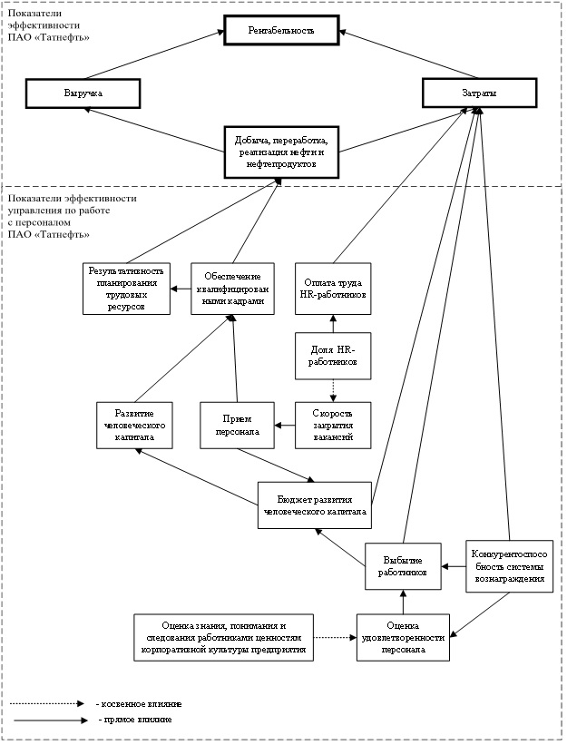
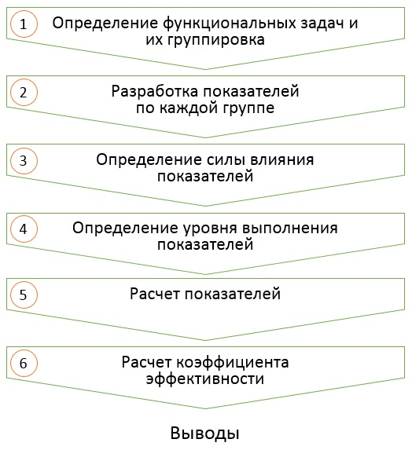

# ОЦЕНКА ЭФФЕКТИВНОСТИ

## Требования к системе оценки

При разработке системы оценки эффективности кадровых процессов следует учитывать, что система должна иметь комплексный характер и включать в себя оценки:

-	экономической эффективности;

-	организационно-управленческой эффективности;

-	социально-психологической эффективности.

Результаты оценки эффективности кадровых процессов, могут быть:

-	количественными;

-	качественными.

Система оценки эффективности кадровых процессов должна придерживаться следующих принципов :

1.	Анализируемые показатели должны иметь **существенную связь со стратегическими целями предприятия**.

2.	Трудоемкость сбора данных по показателям **не должна превышать потенциальную пользу** от их получения.

Начинать анализ целесообразно с тех показателей, которые присутствуют в ежемесячных отчетах предприятия, данных финансовой службы, отдела продаж и т. п. Некоторые показатели по персоналу присутствуют в обязательной статистической отчетности. Если сбор каких-либо данных требует специальных усилий, например создания специального программного обеспечения или осуществления «ручного» подсчета, то для начала нужно оценить, будут ли затраты на их получение стоить той информации, которую удастся извлечь из них.

3.	Более достоверные выводы будут получены **при комплексном (а не раздельном) анализе** нескольких связанных показателей, например динамики производительности труда и показателя удовлетворенности трудом или показателей затрат, связанных с текучестью персонала и кадровым резервом.

4.	Если планируется проведение сравнения полученных результатов с бенчмарками по рынку, то необходимо убедиться, что сбор данных по показателям осуществляется **в соответствии с теми же методиками**, которые используются для сбора бенчмарков. Если бенчмарки собираются по отчетам консалтинговых компаний, то нужно запросить у них формулы, методики, по которым эти бенчмарки рассчитываются.

5.	Оценка показателей должна носить **системный**, а не эпизодический **характер**, для отслеживания оцениваемых показателей в динамике.

Показатели оценки эффективности должны соответствовать следующим требованиям:

-	простота – возможность донесения сути показателя до большинства людей. При этом повышается вероятность правильной реализации оценки и корректности расчета показателя. Также повышается возможность сравнения результатов оценки с показателями других подразделений или предприятий;

-	валидность – способность показателя измерять те критерии, для оценки которых он разработан;

-	надежность – свойство показателя, определяющее относительное постоянство, устойчивость и согласованность его результатов при первичном и повторном его применении на одних и тех же испытуемых, а также независимость от действий случайных факторов;

-	объективность – показатель не должен зависеть от частных мнений;

-	достоверность – оценивается реальный уровень исследуемого показателя;

-	прогнозируемость – результаты должны давать понимание о потенциальных возможностях исследуемого показателя.

## Комплексная оценка

Методика проведения комплексной оценки эффективности деятельности функционального направления "Управление персоналом" состоит из следующих этапов:

1. Определение и группировка функциональных задач.

2. Определение в каждой из сформированных групп функциональных задач показателей, выполнение которых влияет на стратегические цели предприятия.

3. Составление схемы влияния показателей на стратегические цели предприятия.

(ref:shema) Пример схемы влияния показателей на стратегические цели предприятия 

(\#fig:shema)(ref:shema)

4. Методом экспертных оценок проводится фиксация силы влияния каждого из показателей на стратегические цели предприятия.

Рекомендуется не более 3 уровней:
	
- сильное влияние - 3 балла;
	
- среднее влияние - 2 балла;

- слабое влияние - 1 балл.
	
5. Методом экспертных оценок проводится фиксация уровней выполнения показателей. Рекомендуем не более 5 уровней – от 1 до 5 баллов соответственно.

6. Расчет показателей.

7. Расчет средневзвешенной эффективности по формуле:

$$Э_{ср.вз}=\frac{П_1С_1+⋯+П_nС_n}{n},$$
	
где $Э_{ср.вз}$ – средневзвешенная эффективность; $П_n$ – уровень выполнения $n$-ого показателя; $С_n$ – сила влияния $n$-ого показателя; $n$ – количество показателей.

8. Нормирование средневзвешенной эффективности по формуле:

$$К_{эф}=\frac{Э_{ср.вз}}{km},$$

где $К_{эф}$ – коэффициент эффективности деятельности кадровой службы предприятия; $Э_{ср.вз}$ – средневзвешенная эффективность; $k$ – количество уровней силы влияния показателей на стратегические цели предприятия; $m$ – количество уровней выполнения показателей.

9. Оценка полученного значения.

Методом экспертных оценок нами определены следующие уровни коэффициента эффективности деятельности функционального направления "Управление персоналом":

 

  низкий            средний       высокий   
----------------  ------------  ------------- 
    менее 0,40     0,40-0,60     более 0,60 

 

(ref:bigshema) Укрупненная схема проведения оценки эффективности деятельности функционального направления "Управление персоналом" 

(\#fig:bigshema)(ref:bigshema)

<!-- ## Обучение -->
<!-- ### Описание -->
<!-- ### Оценка -->

<!-- ## Мотивация -->
<!-- ### Описание -->
<!-- ### Оценка -->

<!-- ## Удовлетворенность -->
<!-- ### Описание -->
<!-- ### Оценка -->

<!-- ## Вовлеченность -->

<!-- ## Корпоративная культура -->
<!-- ### Описание -->
<!-- ### Оценка -->

<!-- ## Молодежная политика -->
<!-- ### Описание -->
<!-- ### Оценка -->

## Примеры HR-метрик

**Метрики** - от английского *metrics* — стандартные единицы измерения. Система измерений представляет собой специальные расчеты, которые помогают интерпретировать полученные данные, соотнося их с предыдущими результатами.

### Рекрутмент

#### Время на закрытие вакансии

Метрика позволяет узнать среднее время на закрытие одной вакансий в отчётном периоде — с момента получения заявки от заказчика и до принятия предложения кандидатом. Оптимальнее всего проводить перерасчёт ежеквартально, чтобы оценить динамику по итогам года и сделать выводы. Но стоит помнить, что на результат может повлиять и сама вакансия. Одно дело — нанять менеджера по продажам, другое — редкого разработчика или руководителя направления. Поэтому ориентируйтесь на специфику вашей работы. Возможно, стоит сделать разбивку по должностям.

$$\frac{Количество~дней,~потраченных~на~закрытие~вакансий}{Количество~вакансий}$$

#### Стоимость закрытия вакансии

Обычно именно на этот показатель обращают внимание руководители и собственники бизнеса. Некоторые компании используют формулы, основанные на различных коэффициентах и матрицах.

Достаточно учесть все затраты на рекрутмент: внутренние (стоимость работы всех участников найма, выплаты за рекомендации и т. д.), внешние (стоимость программ, услуг рекрутинговых агентств и т. д.) и прямые (стоимость рекламы, плата за размещение вакансии и т. д.). Здесь тоже может понадобиться разбивка по должностям.

$$\frac{Общие~затраты~на~рекрутмент}{Количество~закрытых~вакансий}$$

#### Принятие офферов

Эта метрика показывает, сколько подходящих вам кандидатов, прошедших все этапы отбора, в итоге решили присоединиться к вашей компании и приняли предложение о работе.

Динамика показателей позволит скорректировать политику найма. Почему кандидаты отказываются от оффера? Что можно сделать, чтобы снизить число отказников? Как изменится ситуация, если увеличить финансовое вознаграждение или сделать график более гибким? Это отличное подспорье для экспериментов с условиями труда.

$$\frac{Количество~предложенных~офферов}{Количество~принятых~офферов}$$

### Вовлечённость работников

#### Удовлетворённость работой

Эта метрика позволяет оценить, комфортно ли вашим коллегам в компании. Статистически доказано, что довольные условиями работы сотрудники — и в материальном плане, и чисто психологически — больше вкладываются в результат.

Для подсчёта обычно используют анонимные опросники. В них сотрудникам предлагают выставить различным положительным утверждениям об условиях работы оценки по шкале Ликерта, где 1 балл — это полное несогласие с утверждением, а 5 — наоборот, предельно точное попадание. Затем высчитывается средняя оценка — по отдельной анкете и по всем опрошенным в целом.

Если хотите получить больше инсайтов, проанализируйте ещё и каждый вопрос в отдельности. Где-то могут закрасться сплошные единицы да двойки. Важно помнить, что они не просто влияют на итоговый балл, а сигнализируют, что что-то в вашем офисе идёт не так и пора принять меры.

$$\frac{Общее~количество~баллов}{Общее~количество~вопросов}$$

#### Лояльность работников

Другое название — индекс **eNPS** или *employee Net Promoter Score*. Вычисляется он очень просто и позволяет определить, подумывают ли ваши коллеги о смене работы или хотят оставаться в команде ещё долгие годы. Сотрудникам задают всего один вопрос: «С какой вероятностью от 0 до 10 вы порекомендуете свою компанию в качестве места работы друзьям и знакомым?».

Затем необходимо подсчитать, сколько человек поставили:

- 9−10 — это промоутеры, самые лояльные и воодушевленные сотрудники;

- 7−8 — это нейтралы, у которых всё в порядке, но предложения о работе они рассмотрят с охотой;

- 0−6 — это критики, самая проблемная часть коллектива, которые, скорее всего, уже сейчас находятся в активном поиске работы.

$$\frac{Количество~промоутеров~—~Количество~критиков}{Общее~количество~респондентов}$$

### Обучение персонала

#### Стоимость обучения одного работника

Эта метрика показывает, сколько денег в среднем компания тратит на обучение одного работника. Можно подсчитать отдельно затраты на развитие непосредственно профессиональных навыков и soft skills. Или сделать разбивку по должностям.

$$\frac{Общая~сумма~затрат~на~обучение~всех~работников}{Количество~всех~работников}$$

#### Время обучения одного работника

Здесь практически то же самое, что и в пункте про деньги. Только считать будем не среднюю стоимость обучения, а временные затраты.

$$\frac{Общее~количество~часов~на~обучение~всех~работников}{Количество~всех~работников}$$

### Стабильность команды

#### Ранняя добровольная текучесть

Этот показатель можно считать одним из самых главных. Он определяет эффективность работы HR-команды сразу на нескольких уровнях.

Метрика показывает количество сотрудников, принявших решение покинуть компанию в первый год работы. Изначально ошиблись в найме и наняли кандидата, не подходящего под формальные критерии? Не смогли организовать комфортный процесс адаптации? Или руководитель не умеет вести команду, и от него разбегаются сотрудники?

$$\frac{Количество~уволившихся}{Количество~принятых~на~работу}$$

#### Ранняя недобровольная текучесть

На этот раз мы рассчитываем коэффициент среди тех, с кем пришлось распрощаться по инициативе работодателя. Например, если работник не прошёл испытательный срок, постоянно срывал дедлайны, грубил коллегам или довёл ситуацию до увольнения по каким-то другим причинам.

Если показатель стал резко расти, то это тревожный знак. Возможно, с вашей корпоративной культурой не всё так гладко, как хотелось бы.

$$\frac{Количество~уволенных}{Количество~принятых~на~работу}$$

#### Уровень текучести

За этим показателем нужно следить особенно тщательно. Вряд ли кому-то хочется оказаться в ситуации, когда половина сотрудников — бац! — и уволилась из компании. К тому же в постоянно обновляющемся коллективе вам вряд ли удастся выстроить сильную корпоративную культуру и развить HR-бренд.

$$\frac{Количество~уволившихся}{Общее~количество~работников}$$

